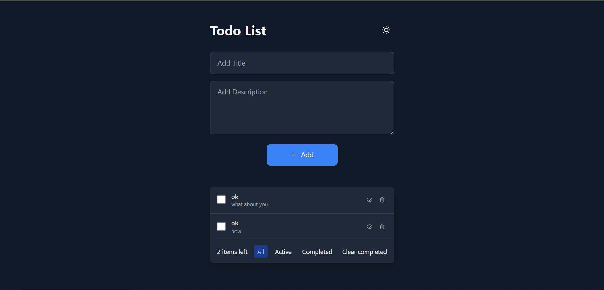
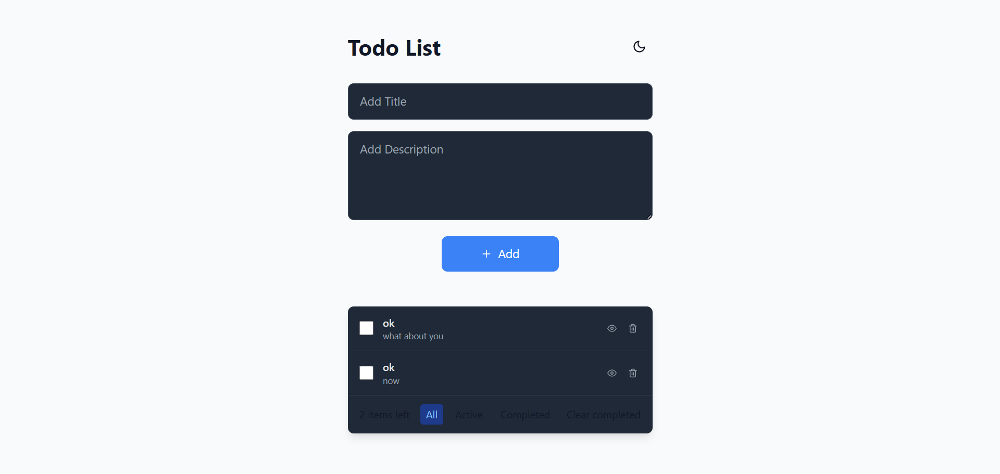
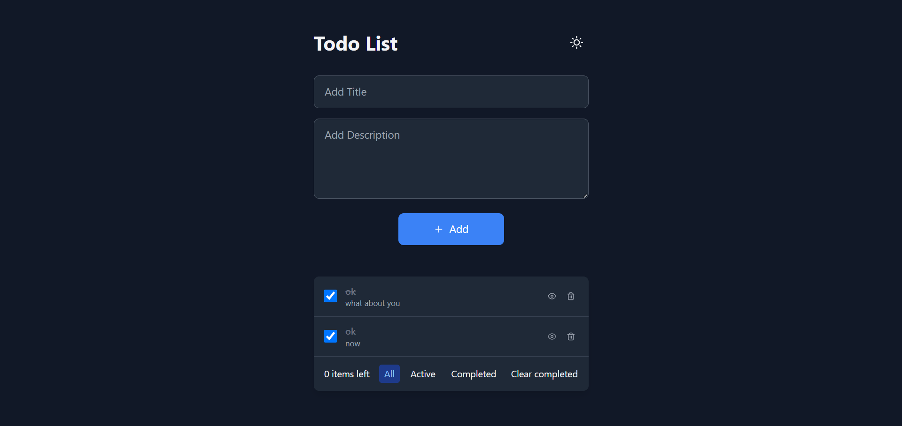
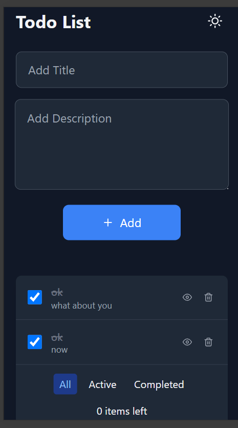

 <!-- Add your screenshot here -->

A full-featured Todo List application built with the MERN stack (MongoDB, Express.js, React, Node.js) with dark/light mode, animations, and local storage persistence.

## ✨ Features

- ✅ **Add, edit, delete todos** with titles and descriptions
- 🌓 **Dark/Light mode** toggle with system preference detection
- 🎨 **Smooth animations** using Framer Motion
- 📱 **Fully responsive** design
- 🔍 **Filter todos** by status (All/Active/Completed)
- 📅 **Created date tracking** for each todo
- 💾 **Local storage persistence** for todos and theme preference
- � **REST API backend** with Express.js and MongoDB

## 🛠️ Technologies Used

### Frontend
- React.js (Vite)
- Framer Motion (Animations)
- Tailwind CSS (Styling)
- React Icons
- Axios (API calls)

### Backend
- Node.js
- Express.js
- MongoDB (Database)
- Mongoose (ODM)
- CORS (Cross-origin requests)

## 🚀 Installation & Setup

### Prerequisites
- Node.js (v16 or higher)
- MongoDB (local or Atlas URI)
- Git

### Backend Setup
1. Clone the repository:
   ```bash
   git clone https://github.com/maaz81/Mern-Todos-App.git
   cd Mern-Todos-App/server


📂 Project Structure
Mern-Todos-App/
├── client/ # Frontend React application
│ ├── public/ # Static files
│ ├── src/ # React source code
│ │ ├── components/ # Reusable components
│ │ ├── App.jsx # Main application component
│ │ └── main.jsx # Application entry point
│ └── package.json # Frontend dependencies
│
├── server/ # Backend Express application
│ ├── models/ # MongoDB models
│ ├── routes/ # API routes
│ ├── app.js # Express application setup
│ └── package.json # Backend dependencies
└── README.md # Project documentation


📷 Screenshots
Light Mode:


Dark Mode:


Mobile View:



   📜 License
Distributed under the MIT License. See LICENSE for more information.

📧 Contact
Your Name - @MaazAhmadKhan - ma3073412@gmail.com

Project Link: https://github.com/maaz81/Mern-Todos-App.git